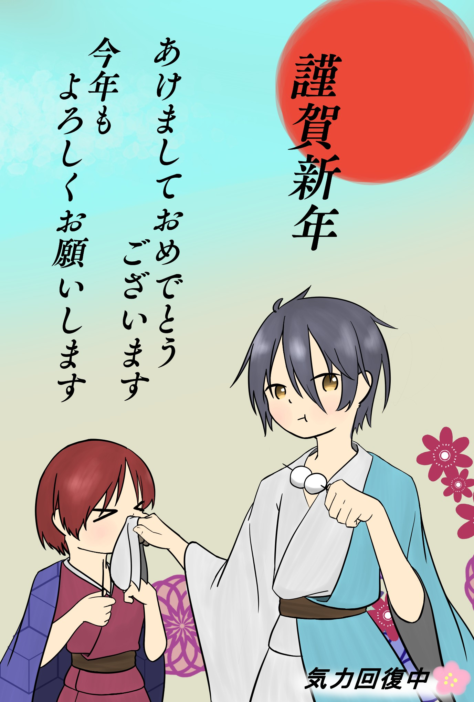
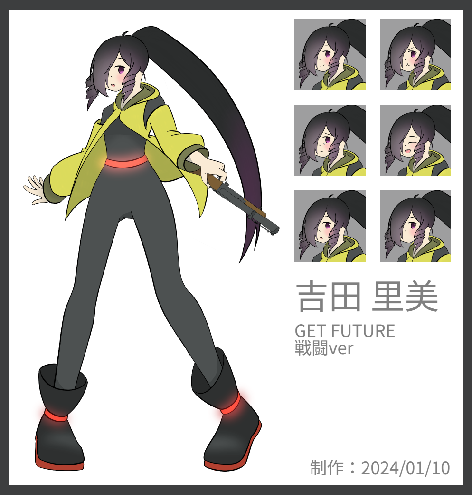

# Portfolio

- koku
- 連絡先 Email [tabuti.dat@gmail.com](mailto:tabuti.dat@gmail.com)
- 専門学校デジタルアーツ東京 ゲームプログラムコース 2024年卒業予定

## 資格

## スキル
- C#
  - 利用歴1年
  - どの程度使えるか
- Unity
  - 利用歴1年
  - どの程度使えるか
- C/C++
  - 利用歴1年
  - どの程度使えるか

## 取り組んでいるテーマ
1. オリジナルCoCシナリオのソロプレイゲーム化

## 作品リスト
- イラスト[2024 謹賀新年]

- イラスト[吉田 里美_GET FUTURE_戦闘立ち絵]

- 

## 連絡先
- E-mail [tabuti.dat@gmail.com](mailto:tabuti.dat@gmail.com)